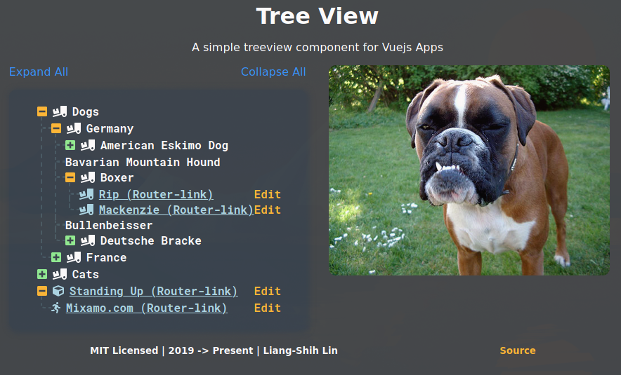

# [@ll931217/vue-treeview](https://www.npmjs.com/package/@ll931217/vue-treeview)

This is a [Vue.js](https://vuejs.org/) plugin I created from the **Erack Server** project, my first ever open-source project. The tree data is in JSON format, and you feed it to the plugin and a treeview will be displayed.